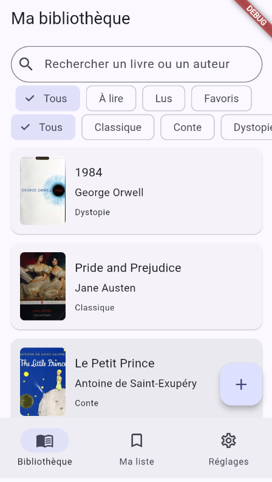
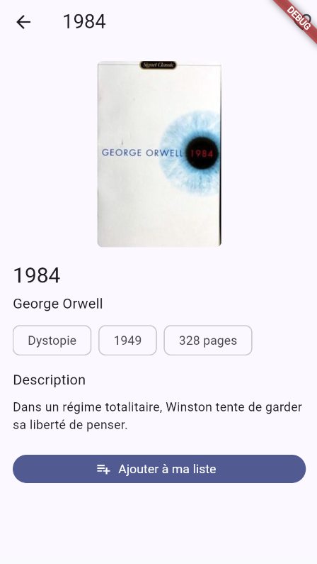
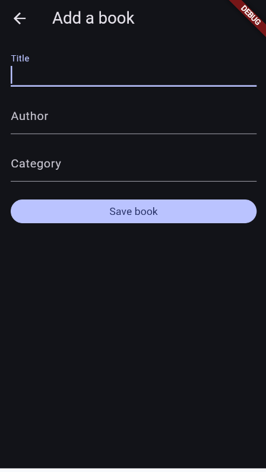
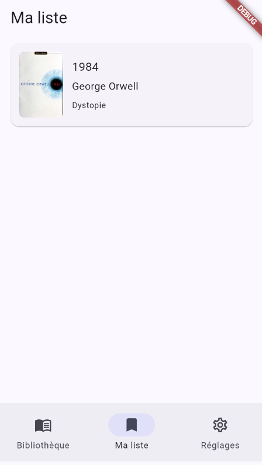
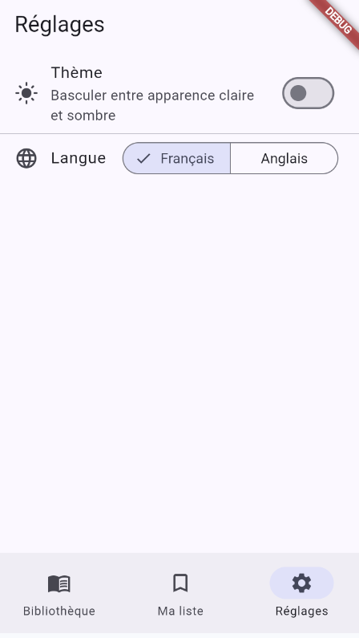
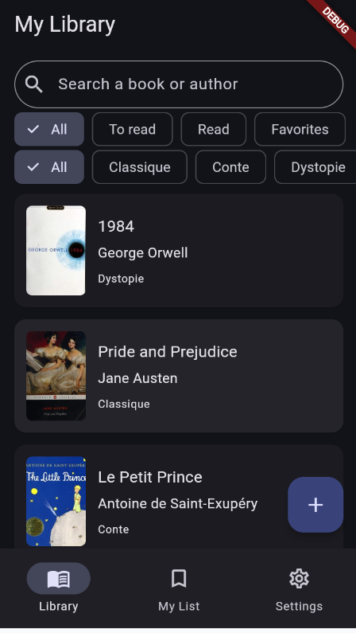

# ReadTrack 📚

[](https://github.com/<TON_USER>/read_track/actions/workflows/ci.yml)


Application Flutter de suivi de bibliothèque personnelle, développée avec une attention particulière portée aux tests, à la performance, à l'accessibilité et à l'internationalisation. Le projet démontre une gestion d'état avec Riverpod, une persistance locale structurée avec Hive, une navigation déclarative avec GoRouter, et une couverture de tests complète sur les trois niveaux (unitaire, widget, intégration).

## Fonctionnalités

- **Bibliothèque** : liste des livres avec recherche en temps réel (titre/auteur), filtres combinables par catégorie et par statut (à lire / lus / favoris)
- **Détail d'un livre** : description, métadonnées (année, pages, catégorie), ajout aux favoris
- **Ajout de livre** : formulaire avec validation par champ (`flutter_hooks`, pas de `State` manuel)
- **Ma liste** : les livres suivis par l'utilisateur, marquage lu/non lu, suppression par balayage avec confirmation
- **Réglages** : thème clair/sombre et langue FR/EN, l'un et l'autre persistés localement
- **Mode hors-ligne natif** : le catalogue est chargé depuis un asset JSON embarqué, aucune dépendance réseau
- **Accessibilité** : labels sémantiques sur tous les éléments interactifs, annonces `liveRegion` pour le contenu qui change de façon asynchrone (voir `ACCESSIBILITY.md`)

## Architecture — séparation par responsabilité

```
lib/
├── main.dart
├── l10n/            # Fichiers .arb (FR/EN) + classes générées par gen-l10n
├── theme/           # Thème clair/sombre (Material 3)
├── models/          # Entités de données : Book, MyListEntry
├── data/            # Repository<T>, BookRepository, MyListStorage, SettingsStorage (Hive)
├── providers/       # Riverpod : catalogue, recherche/filtres, ma liste, locale, thème
├── router/          # GoRouter, 5 routes nommées
├── screens/         # Les 5 écrans de l'application
├── widgets/         # Composants réutilisables (BookCard, SearchBarWidget, ...)
└── utils/           # Fonctions pures (filtre de recherche, responsive)
```

- **`models/`** : entités immuables comparées par valeur (`Equatable`), sans aucune dépendance à Flutter ni à une source de données.
- **`data/`** : implémentation concrète des accès aux données — lecture d'un asset JSON, persistance Hive. `BookRepository` implémente une interface générique `Repository<T>`, ce qui permettrait de le remplacer par une source distante sans toucher au reste de l'app.
- **`providers/`** : composition de l'état via Riverpod. Les écrans ne lisent jamais directement `data/` ; ils dépendent uniquement des providers.

## Gestion d'état et logique de recherche/filtrage

`filteredBooksProvider` compose 5 sources indépendantes : le catalogue (`FutureProvider`), le texte de recherche, la catégorie sélectionnée, le statut sélectionné, et l'état de "Ma liste". Chacune est un provider à part, testable isolément — voir `test/utils/book_filter_test.dart`, qui teste la fonction de filtrage pure sans dépendre de Riverpod ni d'un `WidgetTester`.

`BookRepository` garde un cache en mémoire après le premier chargement : les appels suivants ne relisent pas l'asset JSON. Ce comportement est vérifié explicitement par un test dédié (`test/data/book_repository_test.dart`), plutôt que supposé.

## Persistance locale (Hive)

Deux `Box<String>` distinctes, chacune sérialisée en JSON plutôt que via des adapters générés :
- **`my_list`** : statut lu/favori de chaque livre suivi par l'utilisateur
- **`settings`** : thème et langue choisis

Ce choix (JSON manuel plutôt que `hive_generator`) évite la classe de bugs liée aux adapters générés sur les champs hérités, et garde la sérialisation explicite et testable sans dépendre du moteur Flutter.

## Internationalisation

Support complet FR (par défaut) / EN via `flutter_localizations` et `gen-l10n`. Toutes les chaînes affichées à l'utilisateur passent par `AppLocalizations`, y compris les pluriels (`libraryResultsCount`) et les chaînes paramétrées (`bookDetailPages`). Le changement de langue depuis les Réglages est immédiat, sans redémarrage.

## Génération de code — obligatoire avant de lancer l'app

Ce projet dépend de code généré (adapters et classes de traduction) qui n'est pas commité dans le dépôt :

```bash
flutter pub get
dart run build_runner build --delete-conflicting-outputs   # rien à générer actuellement (pas d'adapter Hive), gardé pour évolutions futures
flutter gen-l10n                                            # génère lib/l10n/generated/app_localizations.dart, requis pour compiler
```

Sans la dernière commande, la compilation échoue : tous les écrans importent les classes générées par `gen-l10n`.

## Installation et lancement

```bash
git clone https://github.com/<TON_USER>/read_track.git
cd read_track
flutter pub get
flutter gen-l10n
flutter run
```

## Lancer les tests

```bash
flutter test                     # tests unitaires + widgets
flutter test integration_test/   # tests d'intégration
```

La suite compte 49 tests répartis sur 3 niveaux — détail complet dans `TEST_COVERAGE.md` :
- **32 tests unitaires** (`test/models/`, `test/data/`, `test/utils/`) : modèles, filtre de recherche, `BookRepository` (chargement, cache, erreurs), `MyListStorage`, `SettingsStorage`
- **15 tests de widgets** (`test/widgets/`, `test/screens/`) : `BookCard`, `LibraryScreen`, `SettingsScreen`, `MyListTile`
- **2 tests d'intégration** (`integration_test/`) : parcours complet ajout→bibliothèque→ma liste ; recherche et filtre par favori à travers plusieurs écrans

Les tests de repository utilisent un `FakeAssetBundle` (`test/support/fake_asset_bundle.dart`) pour servir un catalogue en mémoire, sans dépendre du vrai fichier d'assets ni d'un appel réseau.

## Qualité de code

```bash
flutter analyze
```

Un workflow CI (`.github/workflows/ci.yml`) vérifie le formatage, exécute `flutter analyze --fatal-infos`, lance les tests unitaires/widgets avec couverture, puis les tests d'intégration, à chaque push et pull request sur `main`.

## Distribution

Aucun APK/IPA n'est fourni en pièce jointe du dépôt : l'application n'a pas de backend ni de clé à provisionner, donc une build de démonstration n'apporte pas d'information au-delà du code source. Pour générer un APK de démonstration :

```bash
flutter build apk --release
# sortie : build/app/outputs/flutter-apk/app-release.apk
```

## Documentation complémentaire

- [`ACCESSIBILITY.md`](ACCESSIBILITY.md) — audit d'accessibilité détaillé des 5 écrans
- [`TEST_COVERAGE.md`](TEST_COVERAGE.md) — détail des 49 tests
- [`CHANGELOG.md`](CHANGELOG.md) — historique des versions
- [`SETUP.md`](SETUP.md) — mise en place du projet depuis zéro (bootstrap `flutter create`, premier push)

## Captures d'écran

| Bibliothèque | Détail livre | Ajouter un livre | Ma liste | Réglages | Mode sombre |
|---|---|---|---|---|---|
|  |  |  |  |  |  |
